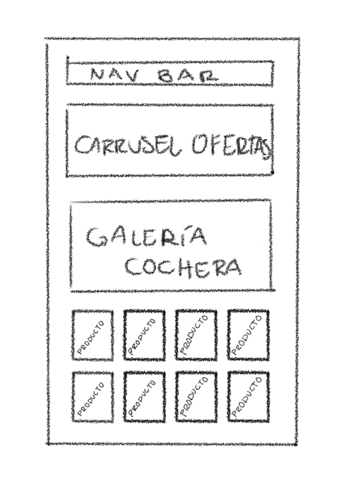
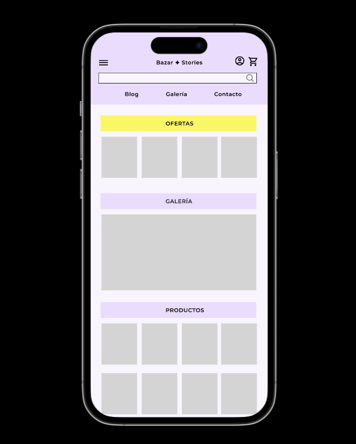
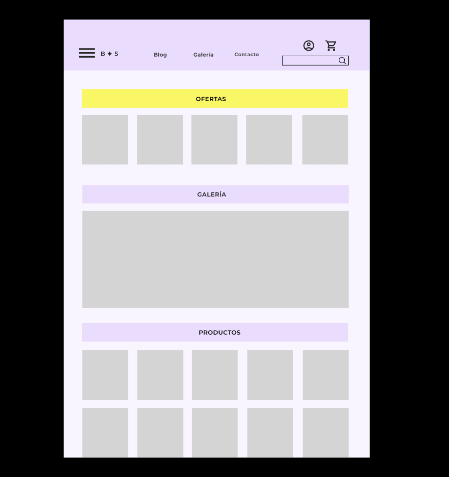
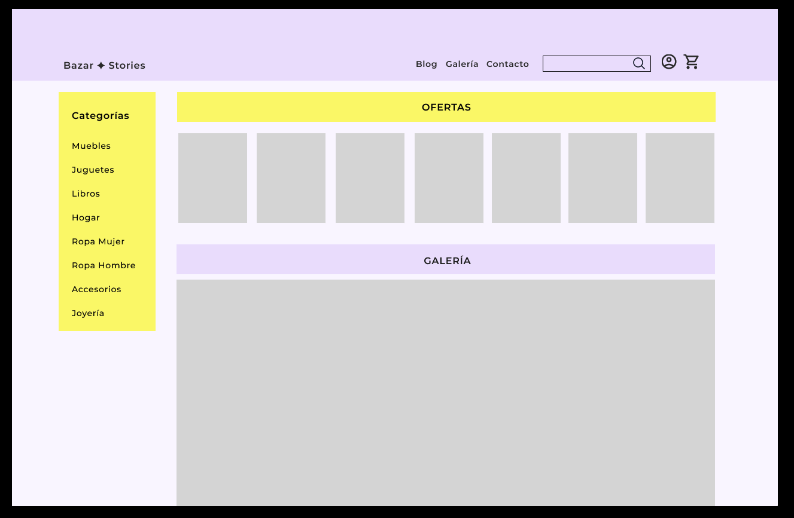

# bazar-stories

# Maquetación
Esta prueba técnica se enfoca en la habilidad de plasmar una idea en un borrador y a su vez en un prototipo funcional para ser presentado al usuario solicitante. Con base en la solicitud del usuario, hacer una propuesta de diseño (borrador, puede ser lápiz o con una herramienta) que incluya un logotipo genérico. El borrador debe ser simple y representativo de los elementos estructurales que serán usados según la interpretación que se hizo de los requerimientos del usuario.
El código desarrollado se encuentra en los archivos de este repositorio.
 
# Solicitud del usuario: 
"Quiero una página web que tenga cinco páginas donde pueda vender mis cosas, 
vender productos usados que compro a otras personas y me gustaría vender en internet. 
A veces los vendo también en mi cochera porque me gusta hablar con las personas y contarles de dónde viene lo que compraron, así como si fuera una historia de todo lo que ha pasado su producto y hacer amistades nuevas, me gusta mucho conocer gente nueva.

En mi página de internet quiero muchas animaciones para que todo brille porque me gusta que se vea llamativa como espectacular de Nueva York, nunca he ido para allá, pero en las películas se ve bien bonito.

Primero quiero que vean unas imágenes que cambian con promociones a veces dura mucho un producto en venderse eso no me gusta quiero que se vendan todos pronto, por eso los pondré en promoción de vez en cuando.

También quiero poner mi teléfono y mi correo y mi WhatsApp y que me escriban por si tienen dudas en una ventanita para que chateen conmigo, aunque no siempre puedo contestar y no tengo más empleados.

No sé cómo organizar mis productos, pero vendo de todas mesas, sillas, lámparas, peluches y todo lo usado.

Estaría chido que puedan calificarme, así como Uber para que se animen otras personas a comprar y yo saber que cosas no les gustan a las personas y que cosas si para mirar de qué compro mas.

Quiero poner muchas fotos, me gusta tomar fotos y que vean que bonito acomodo todo para vender, ¿Se podrá poner también fotos de mi cochera?

Como me gusta platicar quiero escribir también la misma historia que le cuento a mis clientes cuando me compran, pero en lo que vendo eso estaría genial y se vería chido.

Mi página de internet debe ser como yo, fresca, interesante y llamativa no como de mueblería vieja. 

No se usar mucho la computadora por mi edad ya se me dificulta aprender cosas nuevas, pero quiero poder ver mis pedidos, mis mensajes y contestarle a cada cliente, que sientas el amor con el que vendo.

A veces no pueden pasar a recoger los clientes lo que compraron por lo que tengo que mandarlos eso me gustaría también en mi página web.
Me gustaría que pudiera poner mi historia como empecé y así que la gente vea quien soy."
 
## HTML, CSS3, JAVASCRIPT
Esta prueba técnica se enfoca en la habilidad de trasladar un borrador o maqueta a una versión (prototipo) en HTML, que contenga los elementos estructurales de la maqueta, aun cuando el contenido final no ha sido definido.
 
Se debe elegir una pantalla del borrador que diseñaste previamente.

# Prototipo
## Borrador
Se realizó a petición un borrador "muy sencillo" en blanco y negro, el cual contiene el boceto general de lo que incluye la página web en un tamaño de pantalla móvil para poder seguir el formato de trabajo "mobile first".
La herramienta utilizada para este boceto en formato digital fue la aplicación Procreate.
El resultado es el siguiente:

## Prototipo

El prototipo se desarrolló con la herramienta Figma. El resultado puede encontrarse en los siguientes enlaces:

**Versión móvil**

https://www.figma.com/proto/Ok7oGqfbbNWFUFug8dJhM8/Bazar-%E2%9C%A6-Stories?page-id=25%3A323&type=design&node-id=25-394&viewport=-632%2C54%2C0.9&t=D8k2tEG6n0GRCTAa-1&scaling=scale-down&mode=design

**Versión tableta**

https://www.figma.com/proto/Ok7oGqfbbNWFUFug8dJhM8/Bazar-%E2%9C%A6-Stories?page-id=17%3A57&type=design&node-id=17-58&viewport=487%2C411%2C0.64&t=l6VONctlqWZXNJ8Y-1&scaling=min-zoom&mode=design

**Versión escritorio**

https://www.figma.com/proto/Ok7oGqfbbNWFUFug8dJhM8/Bazar-%E2%9C%A6-Stories?page-id=17%3A92&type=design&node-id=17-93&viewport=479%2C371%2C0.36&t=DmbeOQBgjdN4sB6F-1&scaling=min-zoom&mode=design

